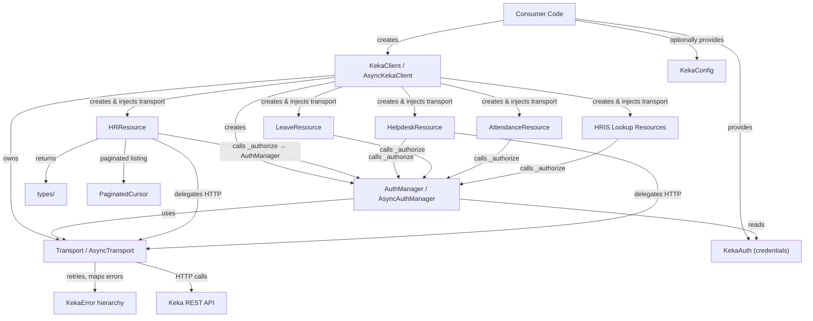
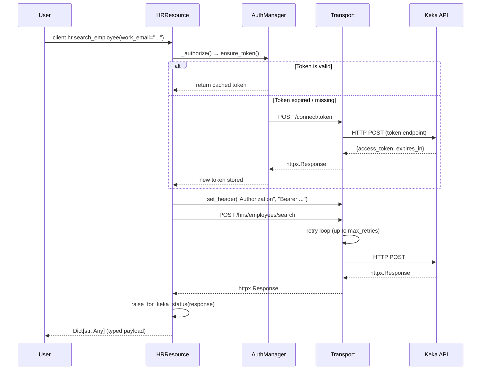
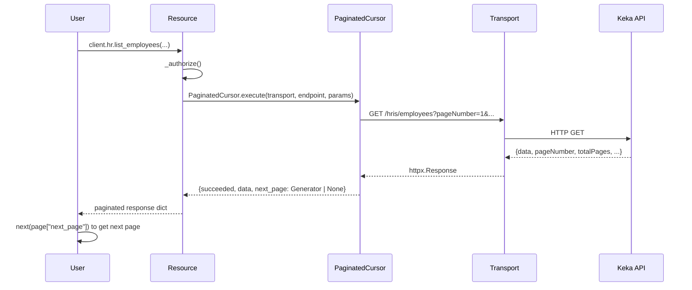
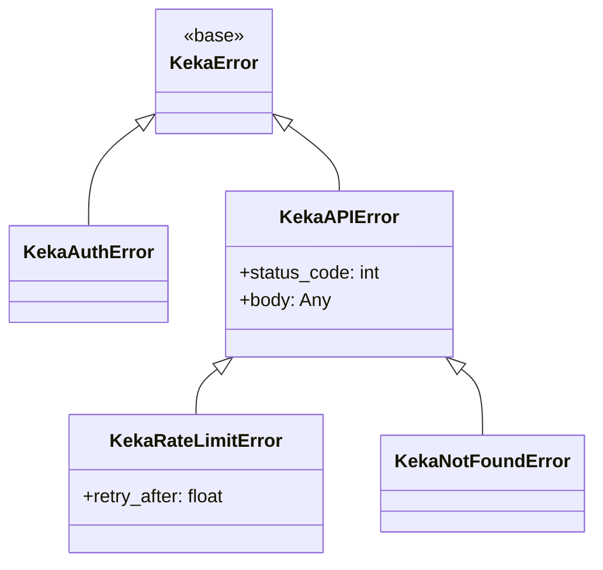

# Architecture

## High-Level Architecture

The SDK follows a **composition-based, single-transport** architecture. One HTTP client (connection pool) is created by the top-level `KekaClient` and injected into every component via constructor parameters.



## Service Boundaries

There is a single importable package (`keka` / `keka_sdk`) with no microservices. Internally the package is layered:

| Layer | Responsibility |
|---|---|
| **Client** (`client.py`) | Facade — owns the transport lifecycle, wires resources |
| **Auth** (`auth.py`) | Token acquisition, caching, refresh, expiry-skew |
| **Transport** (`transport.py`) | HTTP verbs, retry loop, error mapping |
| **Resources** (`resources/`) | Domain logic — endpoint paths, parameter building, typed returns |
| **Types** (`types/`) | Shared `TypedDict` / `Literal` definitions |
| **Utils** (`utils/`) | Pagination cursor |
| **Exceptions** (`exceptions.py`) | Typed error hierarchy |
| **Config** (`config.py`) | Central settings dataclass, login URL derivation |

## Module Interaction Flow

### Request Lifecycle



### Paginated Listing Flow



## Data Flow

1. **Credentials in** → `KekaAuth` dataclass holds `client_id`, `client_secret`, `api_key`.
2. **Config** → `KekaConfig` holds `instance_url`, timeouts, retry policy.
3. **Token endpoint** → derived from `instance_url` (e.g. `acme.keka.com` → `login.keka.com/connect/token`).
4. **Request out** → `Transport` builds URL via `urljoin(instance_url, endpoint)`, runs retry loop.
5. **Response in** → `raise_for_keka_status()` maps HTTP codes to typed exceptions.
6. **Payload out** → Resources call `response.json()` and return `Dict[str, Any]` or typed `TypedDict`.

## Dependency Injection

All injection is **constructor-based** (no service locator, no global state):

```python
# KekaClient.__init__
self.transport = Transport(self.config)
self.auth = AuthManager(self._auth_credentials, self.config, self.transport)
self.hr = HRResource(self.transport, self.config, self.auth)
# ... every resource receives the SAME transport & auth instance
```

Key invariant: **one transport instance, one auth instance, shared by all resources**.

## Retry & Error Strategy

### Retry Core (`_RetryCore`)

- Shared between `Transport` and `AsyncTransport` via inheritance.
- Exponential backoff: `delay = retry_delay × backoff_factor^attempt`, capped at `max_backoff`.
- Random jitter added: `+ uniform(0, config.jitter)`.
- Honors `Retry-After` header on 429 responses.
- Retries on status codes: `{429, 500, 502, 503, 504}` and on `httpx` connection/timeout exceptions.

### Error Hierarchy



## API Structure

The SDK mirrors the Keka API's namespace structure:

| API Namespace | SDK Resource | Base Endpoint |
|---|---|---|
| HRIS Employees | `client.hr` | `hris/employees` |
| Helpdesk Tickets | `client.helpdesk` | `helpdesk/tickets` |
| Time / Leave | `client.leave` | `time` |
| Time / Attendance | `client.attendance` | `time` |
| HRIS Groups | `client.groups` | `hris/groups` |
| HRIS Departments | `client.departments` | `hris/departments` |
| HRIS Locations | `client.locations` | `hris/locations` |
| HRIS Job Titles | `client.job_titles` | `hris/jobtitles` |
| HRIS Currencies | `client.currencies` | `hris/currencies` |
| HRIS Notice Periods | `client.notice_periods` | `hris/noticeperiods` |
| HRIS Exit Reasons | `client.exit_reasons` | `hris/exitreasons` |

## Design Patterns Used

- **Facade** — `KekaClient` unifies all resources behind a single entry point.
- **Composition over Inheritance** — resources have-a transport (not is-a).
- **Template Method** — `_RetryCore` provides the retry skeleton; sync/async subclasses supply I/O.
- **Cursor / Iterator** — `PaginatedCursor` returns a lazy generator for page-by-page traversal.
- **Dataclass Configuration** — `KekaConfig` and `KekaAuth` are `@dataclass` objects.
- **Context Manager** — `KekaClient` and transports implement `__enter__/__exit__` for lifecycle.

## Important Architectural Decisions

1. **Single transport** — eliminates connection pool proliferation when many resources are used.
2. **Token URL derived from instance URL** — avoids hardcoded demo hosts; enables on-prem overrides via `login_url`.
3. **Pagination via cursor generator** — each page's `next_page` field is either a `Generator` or `None`, giving consumers lazy iteration without buffering all pages.
4. **`keka_sdk` compatibility shim** — the canonical package is `keka`, but `keka_sdk/__init__.py` re-exports everything via `from keka import *` to maintain backward compatibility.
5. **Expiry skew** — tokens are considered expired 30 seconds before actual expiry to avoid edge-of-expiry race conditions.
